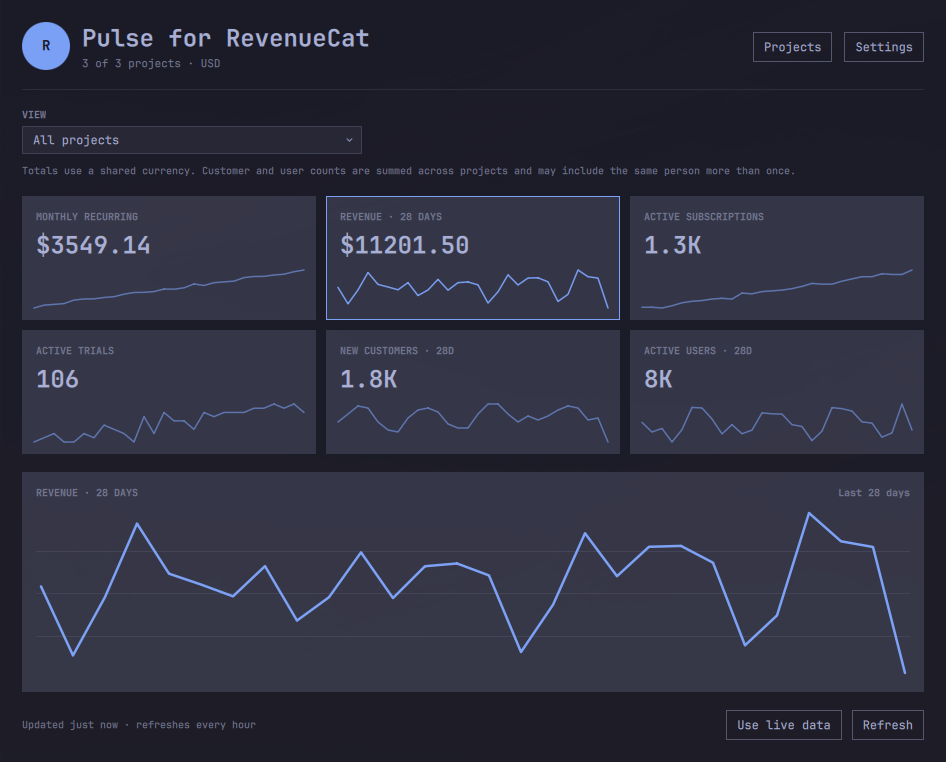
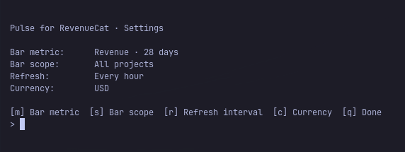

# Pulse for RevenueCat

Pulse for RevenueCat is an unofficial RevenueCat companion for the Omarchy
shell. It combines overview metrics from multiple projects, puts a configurable
MRR or 28-day revenue total in the bar, and provides project dashboards with
compact and expanded 28-day charts.



_Dashboard shown with locally generated demo data._

## Features

- Add any number of RevenueCat projects with one keyring-backed key per project.
- View totals across every enabled project or switch to one project.
- Discover project names from RevenueCat when permission allows.
- Show MRR or 28-day revenue in the bar, for totals or the selected project.
- Display six overview cards with sparklines; click a card to expand its chart.
- Refresh every 15 minutes, 30 minutes, 1 hour, 3 hours, or 6 hours.
- Keep per-project caches so one unavailable project does not blank the dashboard.
- Report rejected keys, missing permissions, rate limits, and stale data in the panel.


_The bar can show compact MRR or 28-day revenue for all projects or the selected project._

## Requirements

- Omarchy Quattro with third-party Quickshell plugin support
- One or more RevenueCat projects with production purchase data
- `curl`, `jq`, `flock` from `util-linux`, `stat` from GNU coreutils, and
  `secret-tool` from `libsecret`
- An unlocked desktop Secret Service/keyring

No root access, background system service, or PolicyKit rule is required.

## Installation

Install the public GitHub repository and enable the plugin:

```bash
omarchy plugin add https://github.com/endijs/omarchy-pulse-for-revenuecat.git --enable
```

Choose the right bar section if Omarchy asks where to place the widget. Then
left-click its bar value and choose **Manage projects** to connect RevenueCat.
CLI examples below use `./revenuecat-control`; run them from either the installed
plugin directory or a source checkout.

## RevenueCat API access (developer preview)

Create a dedicated **v2 secret API key** for each project:

1. Open the project in the RevenueCat dashboard.
2. Go to **Project settings → API keys → New secret API key**.
3. Select API version **V2**.
4. Grant only these read permissions:
   - `project_configuration:projects:read`
   - `charts_metrics:overview:read`
   - `charts_metrics:charts:read`
5. Copy the project ID and generated `sk_…` key.

The metadata permission supplies the project name. If it is missing,
metrics still work and the panel explains which permission to add. Missing
overview or chart permissions are also reported per project.

Remote project icons are intentionally not loaded. RevenueCat does not document
a stable image-host allowlist, so the dashboard uses a project-name initial
instead of allowing metadata to select an unbounded QML network resource.

The key is sent only in the HTTPS `Authorization` header and stored in the
desktop keyring. It is never stored in the repository, QML, `shell.json`,
command-line arguments, or the sanitized metrics cache.

Open the plugin panel and choose **Manage projects**, or run:

```bash
./revenuecat-control manage
```

The manager can add/reconnect, remove, or include/exclude projects from totals.
Configuration that is safe to persist is stored with mode `0600` under
`~/.config/revenue-pulse/`. Per-project sanitized caches use mode `0600` under
`~/.cache/revenue-pulse/`.

Useful commands:

```bash
./revenuecat-control project list
./revenuecat-control project add
./revenuecat-control project remove
./revenuecat-control project toggle
./revenuecat-control status
```

To remove every key and all local state:

```bash
./revenuecat-control logout
```

## Removal

Clear credentials and local metrics while the helper is still installed, then
remove the plugin:

```bash
~/.config/omarchy/plugins/io.github.endijs.pulse-for-revenuecat/revenuecat-control logout
omarchy plugin remove io.github.endijs.pulse-for-revenuecat
```

## Dashboard settings

Choose **Settings** in the panel header, or run:

```bash
./revenuecat-control settings-manage
```



The settings manager configures:

- bar metric: MRR or revenue from the last 28 days;
- bar scope: all projects or the selected dashboard view;
- refresh interval: 15m, 30m, 1h, 3h, or 6h;
- display currency.

The project selector and clickable metric cards remain in the dashboard.

Equivalent helper commands are available for development:

```bash
./revenuecat-control settings bar-metric revenue
./revenuecat-control settings bar-scope selected
./revenuecat-control settings refresh-minutes 60
./revenuecat-control settings selected-project all
./revenuecat-control settings expanded-metric mrr
./revenuecat-control settings currency USD
```

Existing single-project `config.json` files are migrated automatically to the
multi-project schema without moving or re-saving the keyring secret.

## Data and refresh behavior

Each due project refresh requests RevenueCat's overview plus daily 28-day chart
data for MRR, revenue, active subscriptions, active trials, new customers, and
active users. Requests are paced within a project, with at most three projects
running concurrently. Project names are refreshed at most once per
day. Every project has its own sanitized, currency-aware cache; failed projects
remain visible as stale while successful projects continue updating.

On shell startup, the panel restores the last sanitized snapshot immediately
and refreshes it only when the configured interval has elapsed. Opening the
panel or switching between totals and projects uses the same per-project
freshness check. Only projects whose interval has elapsed are requested. The
panel Refresh button and the bar widget's right-click action explicitly
override the configured interval for their current scope. Server-provided
RevenueCat `Retry-After` limits are still honored before any further attempt,
up to a defensive maximum of 24 hours. A successful reconnect or refresh
clears old backoff state.
The setup screen appears only
after the helper confirms that no projects are configured.

Changing display-only settings reloads local state without making API calls.
Changing currency invalidates incompatible cached monetary values and fetches
new values rather than relabelling old numbers.

Totals use one configured currency. Monetary values and subscription/trial
counts are additive. Customer and active-user counts are sums across projects,
not guaranteed unique people.

Chart requests cover an inclusive UTC range from 27 days ago through today.
Today's flow metrics may therefore be partial. The overview cards use the
28-day values returned directly by RevenueCat. RevenueCat's mobile app can also
show slightly different values while it uses a different Charts generation.

Every API transfer has a 1 MiB body ceiling and a separate 128 KiB response
header ceiling before local parsing. The helper also bounds project metadata,
overview metrics, and chart point counts before normalization. Responses that
exceed those limits are discarded and handled like an unavailable or malformed
API response, with an existing sanitized cache used when possible.

## Demo mode

Demo mode works with or without configured projects and is safe to use for
screenshots. It generates three fictional projects and representative metrics
locally; demo refreshes do not contact RevenueCat or write settings, credentials,
or cached metrics.

```bash
omarchy-shell shell summon io.github.endijs.pulse-for-revenuecat '{"demo":true}'
```

Wait until the fictional data has loaded and **Use live data** is visible before
capturing a screenshot, since a previously loaded live snapshot may remain on
screen during the brief transition. Choose **Use live data** to leave demo mode.

## Local development

Link this checkout into Omarchy, validate it, and enable it:

```bash
plugin_source=/path/to/omarchy-pulse-for-revenuecat
ln -s "$plugin_source" \
  ~/.config/omarchy/plugins/io.github.endijs.pulse-for-revenuecat
omarchy plugin validate "$plugin_source"
omarchy-shell shell rescanPlugins
omarchy plugin enable io.github.endijs.pulse-for-revenuecat --section right
```

Left-click the bar value to toggle the dashboard. Right-click it to refresh.

Run the regression suite with:

```bash
./tests/run.sh
```

## Authentication

The current developer preview uses dedicated, read-only RevenueCat v2 API keys
stored locally in Secret Service. A future release might include OAuth support,
which RevenueCat recommends for third-party clients.

## Naming and trademark notice

“Pulse for RevenueCat” describes compatibility and is not presented as an
official RevenueCat product. RevenueCat is a trademark of RevenueCat, Inc. This
project is independent, unofficial, and is not affiliated with, sponsored by,
or endorsed by RevenueCat, Inc.

## License

MIT
